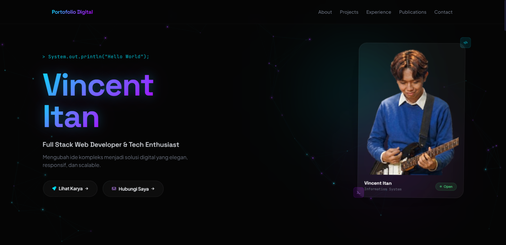
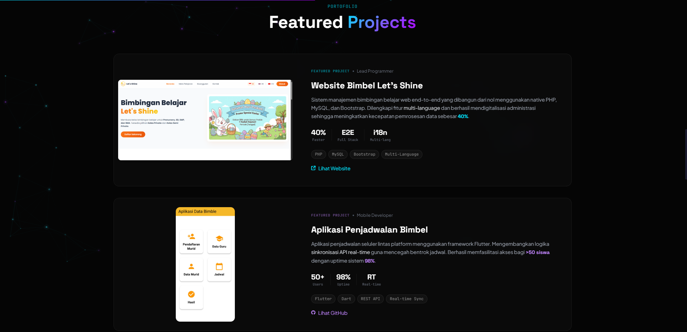

<h1 align="center">
  <br>
  🌐 Portofolio Digital — Vincent Itan
  <br>
</h1>

<p align="center">
  <strong>Modern, Interactive, Single-Page Portfolio Website</strong><br>
  <em>Built with Tailwind CSS, Vanilla JavaScript, and a whole lot of passion.</em>
</p>

<p align="center">
  
  
  
  
</p>

---

## 📖 Deskripsi

Website portofolio digital **single-page** yang dirancang untuk menampilkan profil profesional sebagai **Full Stack Web Developer**. Dibangun dengan fokus pada **desain premium**, **interaktivitas tinggi**, dan **user experience** yang memukau.

Website ini menampilkan:

- 🎯 **Profil & Keahlian** — Informasi personal, tech stack, dan pendidikan
- 💼 **Featured Projects** — Showcase proyek utama dengan screenshot dan link demo
- 🏢 **Pengalaman Organisasi** — Timeline pengalaman berorganisasi di kampus
- 📚 **Publikasi Ilmiah** — Jurnal penelitian yang telah diterbitkan
- 📬 **Contact Section** — Link ke Email, LinkedIn, dan GitHub

---

## 📸 Screenshot

### Hero Section
> *Glassmorphism photo card dengan floating animation, glowing orbs, dan typing effect.*



### Projects Section
> *Showcase proyek dengan screenshot dan link demo/GitHub.*




---

## 🛠️ Tech Stack

| Teknologi | Kegunaan |
|-----------|----------|
| **HTML5** | Struktur halaman (Semantic HTML) |
| **Tailwind CSS** (CDN) | Styling & responsive design |
| **Vanilla JavaScript** | Interaktivitas & animasi |
| **Font Awesome 6** | Iconography |
| **Google Fonts** | Tipografi (Plus Jakarta Sans, Space Grotesk, JetBrains Mono) |

### ✨ Fitur Interaktif

- 🎨 **Animated Particle Background** — Canvas-based particle system dengan koneksi antar partikel
- 🃏 **3D Tilt Effect** — Kartu proyek bergerak 3D mengikuti posisi mouse
- ⌨️ **Typing Animation** — Efek mengetik pada sapaan kode di Hero Section
- 🪄 **Floating Glassmorphism Card** — Foto profil dalam kartu kaca yang melayang
- 🔵🟣 **Glowing Orbs** — Blob cahaya cyan & purple yang berdenyut di belakang foto
- ✨ **Glow Text Shadow** — Efek cahaya pada nama
- 🔘 **Premium Glass Buttons** — Tombol dengan animated gradient border saat hover
- 📜 **Scroll Reveal Animation** — Elemen muncul saat di-scroll menggunakan Intersection Observer
- 📱 **Fully Responsive** — Mobile, Tablet, dan Desktop

---

## 📂 Struktur Proyek

```
PERSONAL-BRANDING/
├── index.html          # Single-file (HTML + CSS + JS)
├── README.md           # Dokumentasi project
└── assets/
    ├── vincent.png      # Foto profil
    ├── letsshine.png    # Screenshot - Website Bimbel Let's Shine
    ├── bimbel-app.jpg   # Screenshot - Aplikasi Penjadwalan Bimbel
    ├── absensi.png      # Screenshot - Sistem Absensi & Pengajuan Izin
    └── hmsi.png         # Logo HMSI Universitas Universal
```

---

## 🚀 Cara Menjalankan Project

### Prasyarat

- Web browser modern (Chrome, Firefox, Edge, Safari)
- Koneksi internet (untuk memuat CDN: Tailwind CSS, Font Awesome, Google Fonts)

### Langkah-Langkah

1. **Clone repository ini:**

   ```bash
   git clone https://github.com/VincentI123/PERSONAL-BRANDING.git
   ```

2. **Masuk ke folder project:**

   ```bash
   cd PERSONAL-BRANDING
   ```

3. **Buka file `index.html`:**

   - **Opsi 1:** Double-click file `index.html` di File Explorer
   - **Opsi 2:** Gunakan Live Server (VS Code Extension)
     ```
     # Install extension "Live Server" di VS Code
     # Klik kanan index.html → "Open with Live Server"
     ```
   - **Opsi 3:** Gunakan terminal
     ```bash
     # Windows
     start index.html

     # macOS
     open index.html

     # Linux
     xdg-open index.html
     ```

4. **Selesai!** 🎉 Website akan terbuka di browser.

---

## 🌐 Live Demo

> _Tambahkan link deploy di sini setelah hosting (Netlify, Vercel, GitHub Pages, dll.)_

```
https://your-portfolio-url.com
```

---

## 📝 Lisensi

© 2026 **Vincent Itan**. All rights reserved.

---

<p align="center">
  <em>Dibuat dengan ❤️ dan ☕ oleh Vincent Itan</em>
</p>
